# training360-szoftverarchitekturak

## Standalone konzolos alkalmazás
#### Rekordok kilistázása konzolos menüből

#### Rekord törlése konzolos menüből

#### Script készítése és alkalmazása

## Standalone alkalmazás grafikus felülettel

#### Új rekord megjelenítése

#### Adatbázis elmentése

#### Új rekord hozzáadása

## Központi adatbázis

#### Új rekord hozzáadása

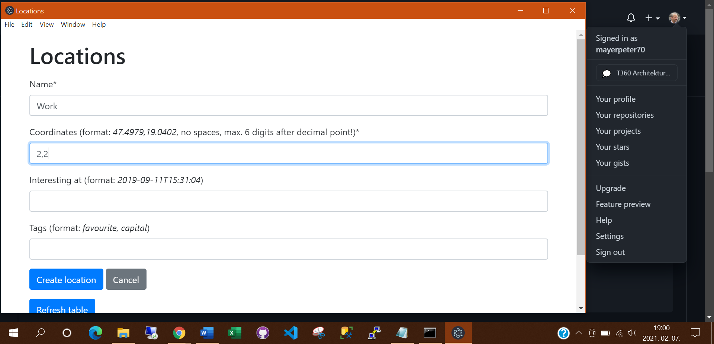

#### MariaDB adatbázis beállítása DBeaveren

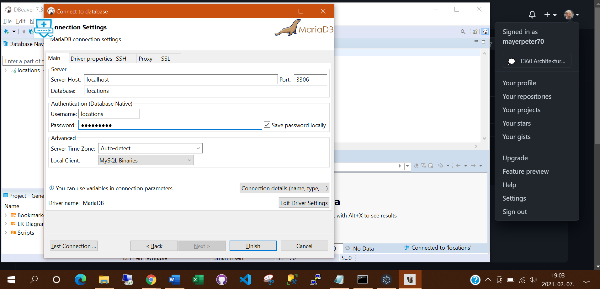

#### Tábla szerkezetének megjelenítése

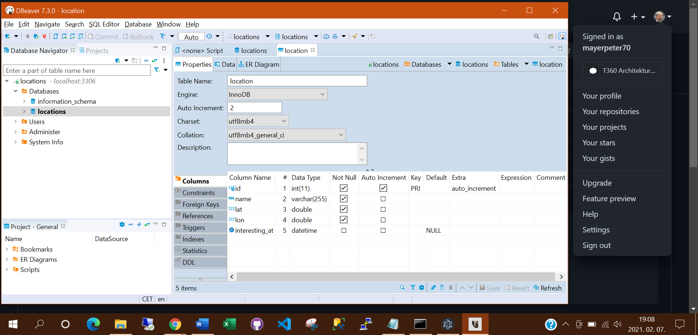

## SQL nyelv

#### location tábla szerkezetének és tartalmának kiíratása SQL utasításokkal  

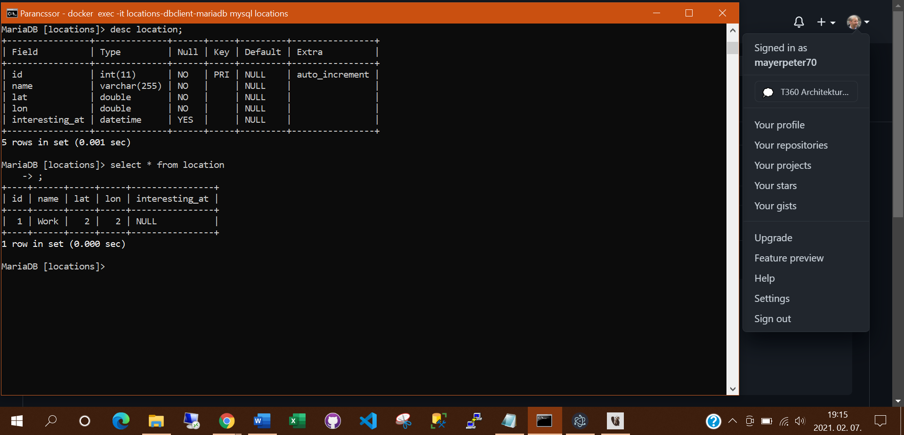

#### location tábla tartalmának kiíratása SELECT utasítással DBeaverben

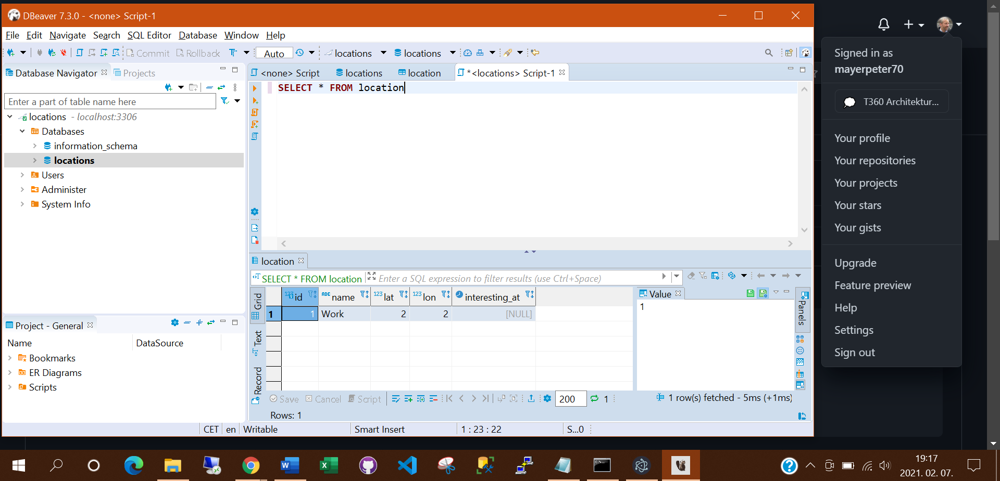

#### tag tábla tartalmának kiíratása SELECT utasítással DBeaverben

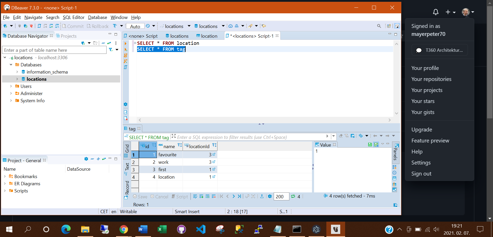

## NoSQL adatbázisok

#### Konfigurációs file módosítása 

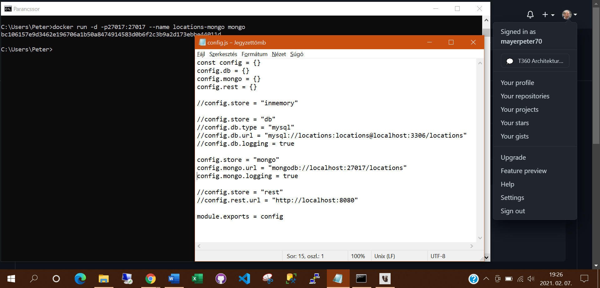

#### Új dokumentum rögzítése tagekkel grafikus felületen 

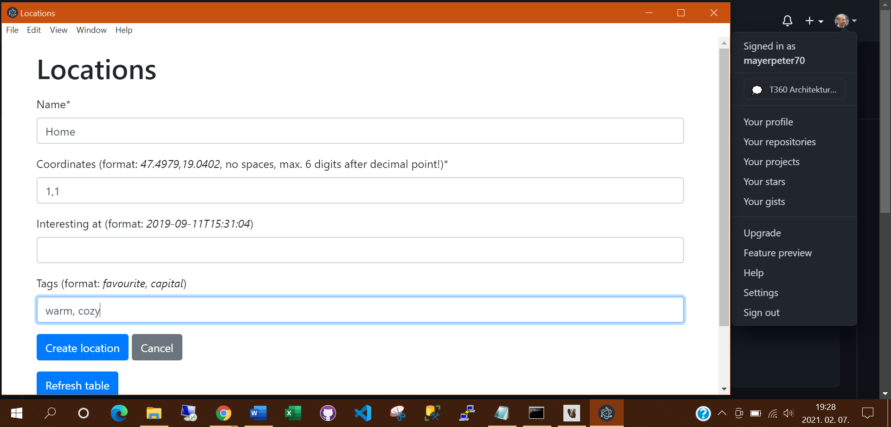

####Új dokumentum rögzítése és rekordok kiíratása konzolon

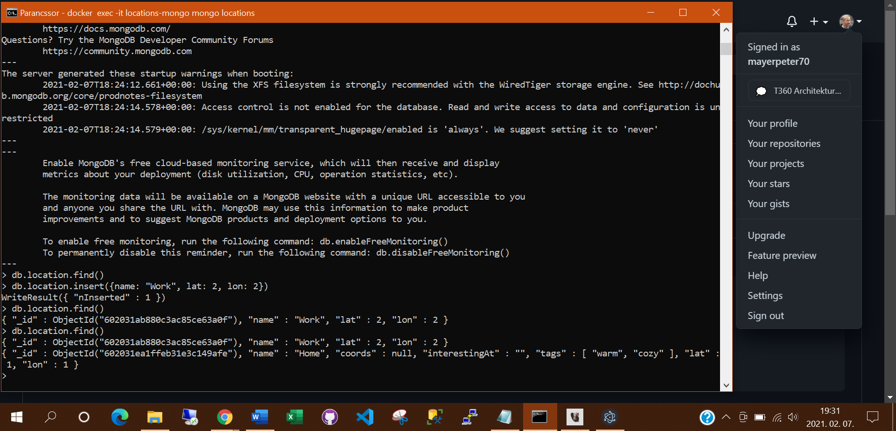

## Többrétegű alkalmazás

#### Konténer kiürítés és új adatbázis és szerveralkalmazás indítása  

#### 

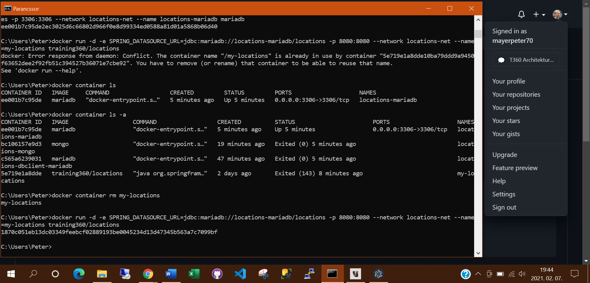

#### Grafikus felületen végzett változtatások nyomon követése logfileban 

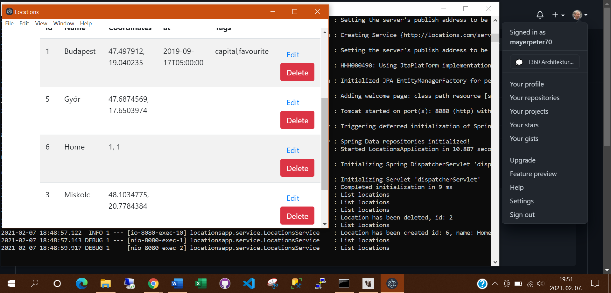

## Webes alkalmazás

#### Korábbi adatbázisok kitörlése és új adatbázis indítása 

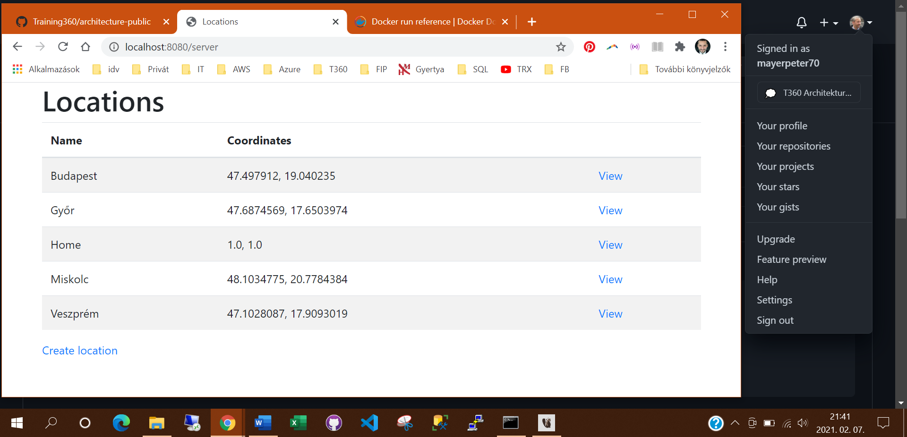

####

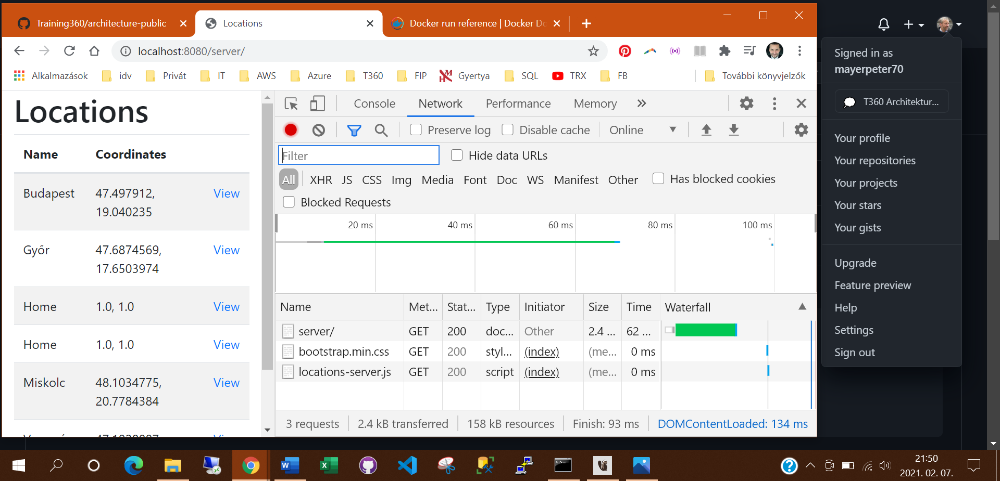

####

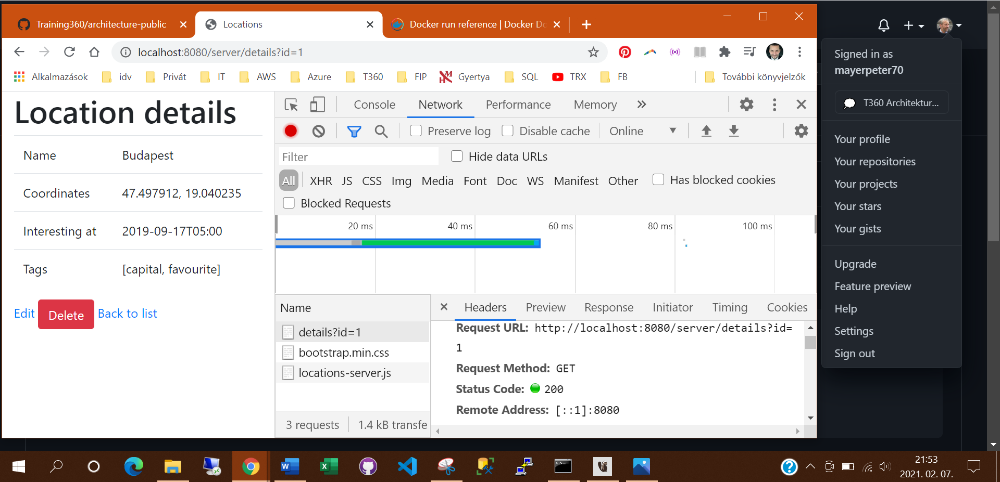

## Web formátumai: HTML és CSS

#### HTML kód elkészítése és betöltése

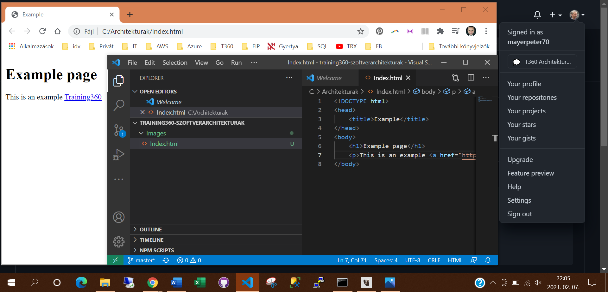

#### HTML megjelenítése konzolon 

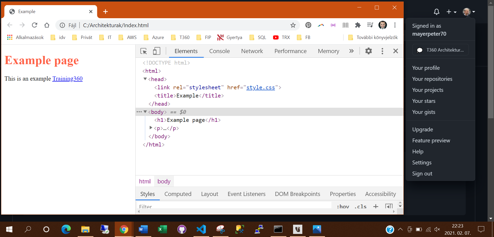

#### CSS megjelenítése konzolon 

