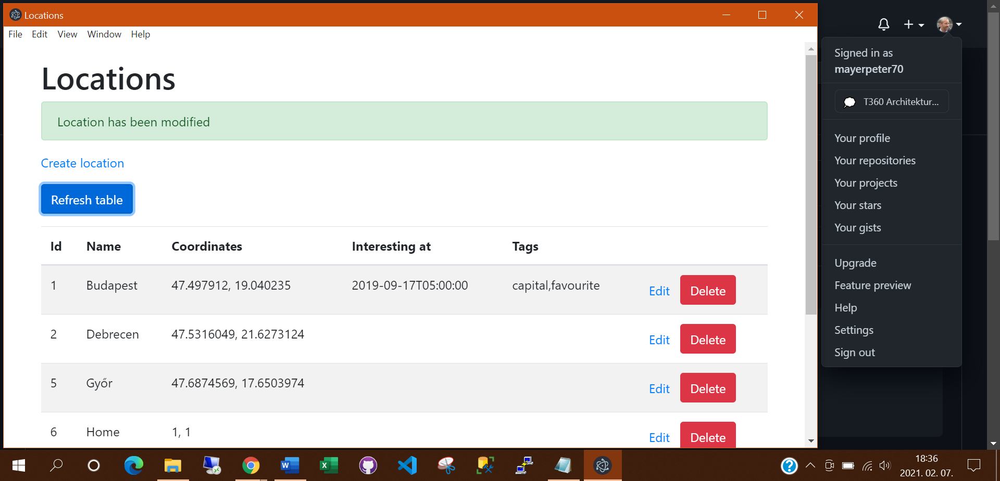
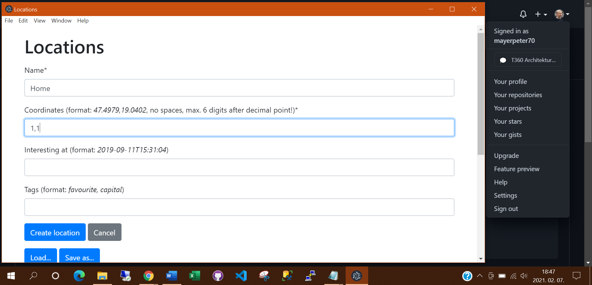

# training360-szoftverarchitekturak

## Standalone konzolos alkalmazás
#### Rekordok kilistázása konzolos menüből

#### Rekord törlése konzolos menüből

#### Script készítése és alkalmazása

## Standalone alkalmazás grafikus felülettel

#### Új rekord megjelenítése

#### Adatbázis elmentése

#### Új rekord hozzáadása

## Központi adatbázis

#### Új rekord hozzáadása

#### MariaDB adatbázis beállítása DBeaveren

#### Tábla szerkezetének megjelenítése

## SQL nyelv

#### location tábla szerkezetének és tartalmának kiíratása SQL utasításokkal  

#### location tábla tartalmának kiíratása SELECT utasítással DBeaverben

#### tag tábla tartalmának kiíratása SELECT utasítással DBeaverben

## NoSQL adatbázisok

#### Konfigurációs file módosítása 

#### Új dokumentum rögzítése tagekkel grafikus felületen 

####Új dokumentum rögzítése és rekordok kiíratása konzolon

## Többrétegű alkalmazás

#### Konténer kiürítés és új adatbázis és szerveralkalmazás indítása  

#### 

#### Grafikus felületen végzett változtatások nyomon követése logfileban 

## Webes alkalmazás

#### Korábbi adatbázisok kitörlése és új adatbázis indítása 

####

####

## Web formátumai: HTML és CSS

#### HTML kód elkészítése és betöltése

#### HTML megjelenítése konzolon 

#### CSS megjelenítése konzolon 

