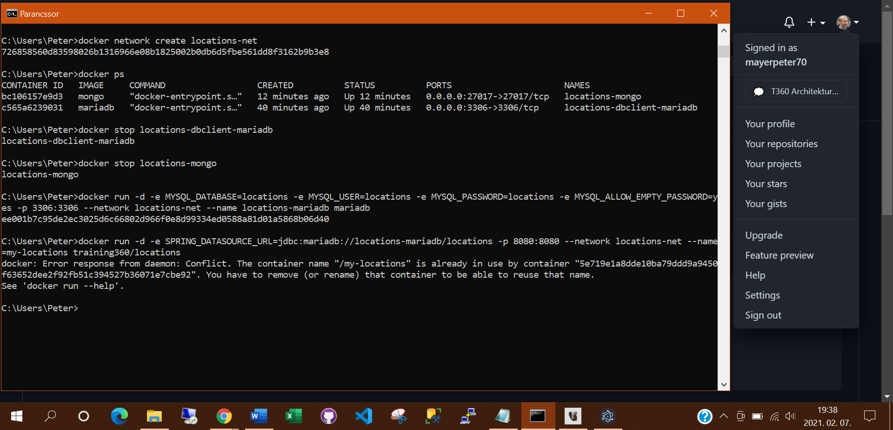
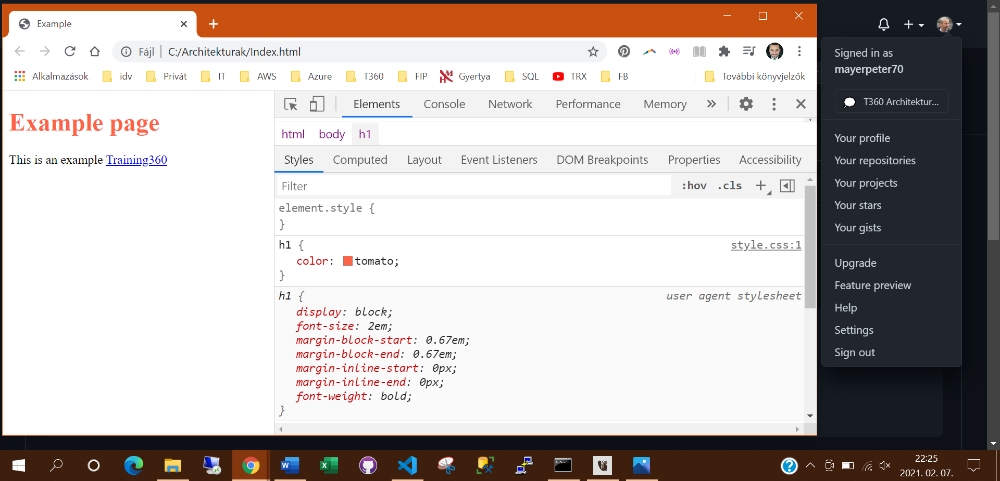

# training360-szoftverarchitekturak

## Standalone konzolos alkalmazás
### Rekordok kilistázása konzolos menüből

### Rekord törlése konzolos menüből

### LocationsCli vezérlése konzolos menüből

## Standalone alkalmazás grafikus felülettel

## Központi adatbázis

## SQL nyelv

## NoSQL adatbázisok

## Többrétegű alkalmazás

## Webes alkalmazás

## Web formátumai: HTML és CSS

